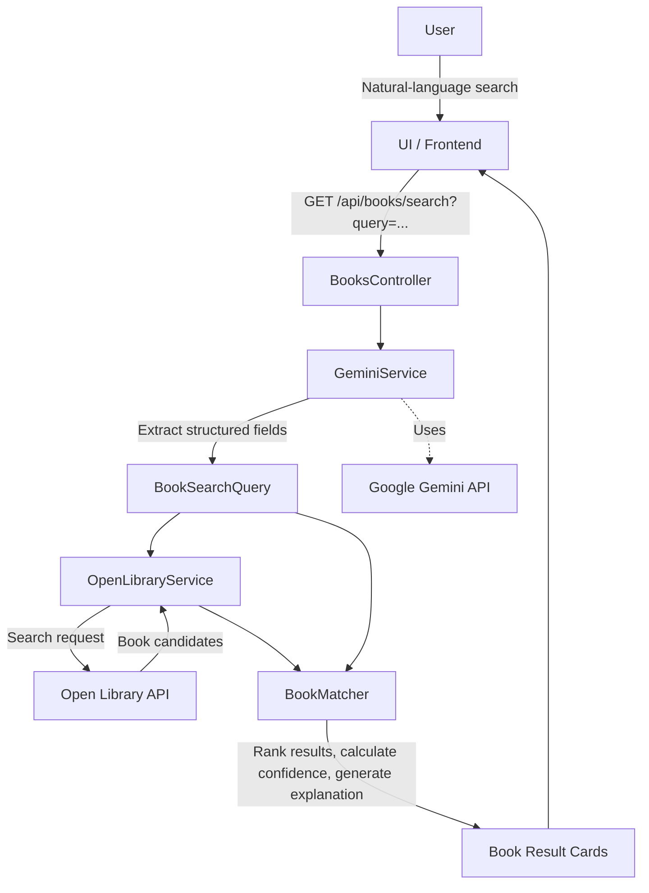

## Description

This application provides a natural-language book search experience that allows users to describe what they are looking for in their own words rather than relying on traditional search fields. The application interprets the user's request and identifies relevant search information including book titles, authors, subjects and keywords, places, people, publishers, languages, and publication year ranges. This information is then used to find and rank matching books based on how closely each result aligns with the user's request. Results are presented with relevant book details, a confidence score, and an explanation of why each book was considered a match. The goal is to make book discovery more intuitive while still providing transparent and useful search results.

## Overall Design



## Application Components/Responsibility

| Component            | Responsibility                                      |
| -------------------- | --------------------------------------------------- |
| Client Application   | User interaction and displaying results             |
| `BooksController`    | HTTP/API orchestration                              |
| `GeminiService`      | Natural-language → structured search query          |
| `BookSearchQuery`    | Structured representation of the user's search      |
| `OpenLibraryService` | Open Library API integration                        |
| `BookCandidate`      | Normalized representation of an Open Library result |
| `BookMatcher`        | Ranking, confidence score, and explanation          |
| Open Library         | Actual book search/data                             |

**Getting Started**

## Getting a Gemini API Key

1. **Visit Google AI Studio**
   Go to the official [Google AI Studio](https://aistudio.google.com/) platform.

2. **Log In**
   Sign in using your standard Google Account.

3. **Accept the Terms**
   Read and accept the terms of service if prompted.

4. **Create an API Key**
   Click **"Get API key"**, usually located in the top-left corner of the dashboard.

5. **Select a Project**
   Click **"Create API key"**. You can attach the key to an existing Google Cloud project or automatically create a new one.

6. **Copy and Save**
   Copy your generated API key and store it securely. Do not commit it to GitHub or include it directly in your source code.

## Setting Your Gemini API Key

1. **Open your terminal** and navigate to the project root directory.

2. **Run the following commands:**

```bash
cd server/Api
dotnet user-secrets init
dotnet user-secrets set "Gemini:ApiKey" "YOUR_ACTUAL_API_KEY"
```

## Run these commands initially to set up dependencies

**Frontend**

1. Change current directory to Client.
2. Run npm i

**Backend**

1. Change current directory to Server.
2. dotnet restore

## To run Locally

**Frontend**

1. Change current directory to Client.
2. Run npm run dev

**Backend**

1. Change current directory to Server.
2. dotnet run --project Api/Api.csproj

## To run unit tests

1. Change current directory to the Root root of the project.
2. dotnet test server/Api.Tests/Api.Tests.csproj

## TODO / next steps

Visit this file to get ideas on how to better the application: docs/ImprovementNotes.md

```

```
